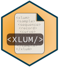

<!-- README.md was auto-generated by README.Rmd. Please DO NOT edit by hand!-->

# xlum 

The R package `'xlum'` to interface `<xlum/>` a data format for exchange
and long-term preservation of luminescence data.

[](https://www.repostatus.org/#Concept)
[](https://cran.r-project.org/package=xlum)

[](https://codecov.io/github/R-Lum/xlum?branch=master)
[](https://github.com/R-Lum/xlum/actions)

## Installation

#### i. Requirements

-   *Windows (32/64bit)*:
    [Rtools](https://cran.r-project.org/bin/windows/Rtools/) (provided
    by CRAN)
-   *macOS*: [Xcode](https://developer.apple.com/) (provided by Apple)
-   *Linux*: [gcc](https://gcc.gnu.org) often comes pre-installed in
    most distributions.

##### The plain **R** way

To install the stable version from CRAN, simply run the following from
an R console:

``` r
install.packages("xlum")
```

To install the latest development builds directly from GitHub, run

``` r
if(!require("devtools"))
  install.packages("devtools")
devtools::install_github("R-Lum/xlum@<wanted branch>")
```

## Note

**The package comes without any guarantee!**

Please further note that this version is a development version and may
change day by day. For stable branches please visit the package on [CRAN
xlum](https://CRAN.R-project.org/package=xlum).

## License

This program is free software: you can redistribute it and/or modify it
under the terms of the GNU General Public License as published by the
Free Software Foundation, either version 3 of the License, or any later
version.

This program is distributed in the hope that it will be useful, but
WITHOUT ANY WARRANTY; without even the implied warranty of
MERCHANTABILITY or FITNESS FOR A PARTICULAR PURPOSE. See the [GNU
General Public License](https://github.com/R-Lum/xlum/blob/main/LICENSE)
for more details.

## <span class="glyphicon glyphicon-euro"></span> Funding

The [development of xlum](https://github.com/R-Lum/xlum) benefited
received funding from the European Union’s Horizon 2020 research and
innovation programme under the Marie Skłodowska-Curie grant agreement No
844457 (project: [CREDit](https://cordis.europa.eu/project/id/844457)).

## Related projects

-   [Luminescence](https://github.com/R-Lum/Luminescence)
